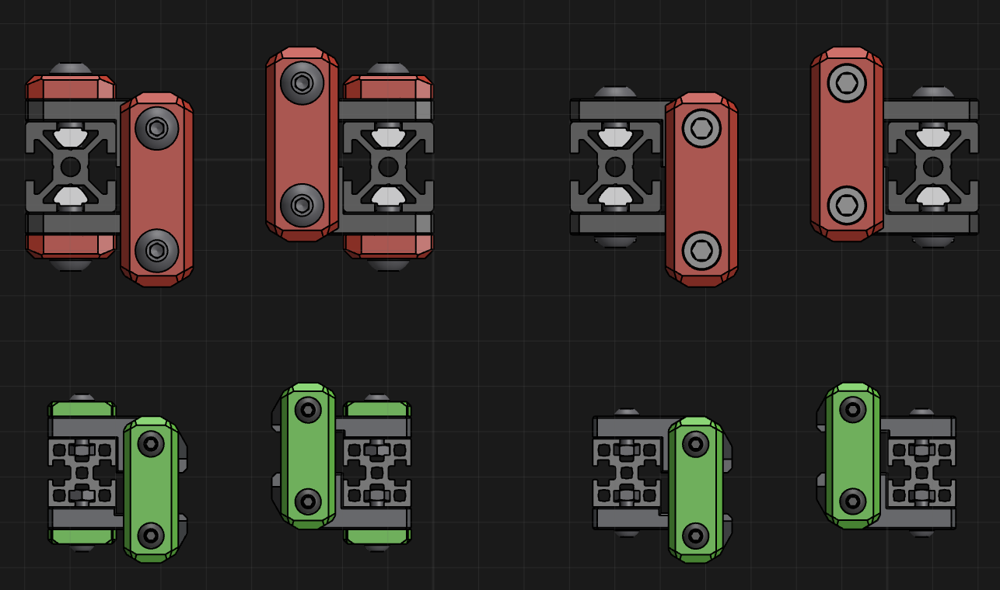

# BFI (Beefy Front Idlers)

These idlers were designed with one core principle: use belt tension to *compress* printed layers instead of splitting or pulling them apart.

This design is available for Voron Trident, Voron 2.4, Salad Fork, and Micron.

For Trident and V2.4, you'll need:
- 4x M5x30 BHCS 
- 2x 5mm-diameter pin, 18mm long
- 2x M5 hex nuts

For Salad Fork and Micron, you'll need:
- 4x M3x20 BHCS
- 2x M3x12 SHCS
- 2x standard Voron M3x5x4 heatset inserts (5mm outer diameter, 4mm deep)

...plus the same shim/bearing stack setup for each idler as the original stock front idlers.
