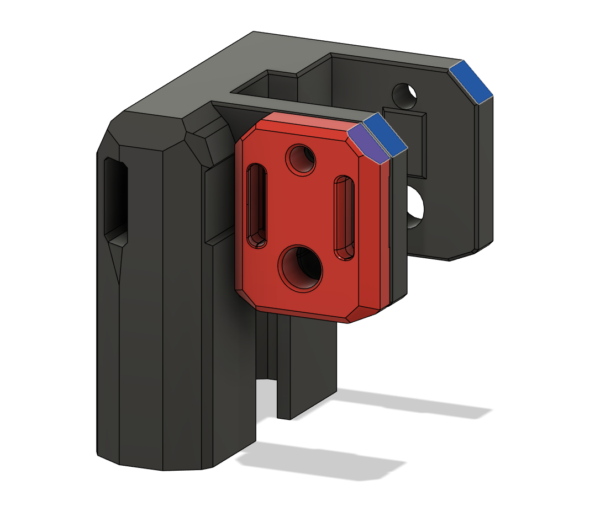

## V2.4 Housing with 45 degree overhang.

The angle on the housing was really steep. I cut it off and blended it with a chamfer to blend it in. It does make the default belt holder overhang on the back so I've added the same geometry to work with both A and B.

Mostly for print aesthetics.
