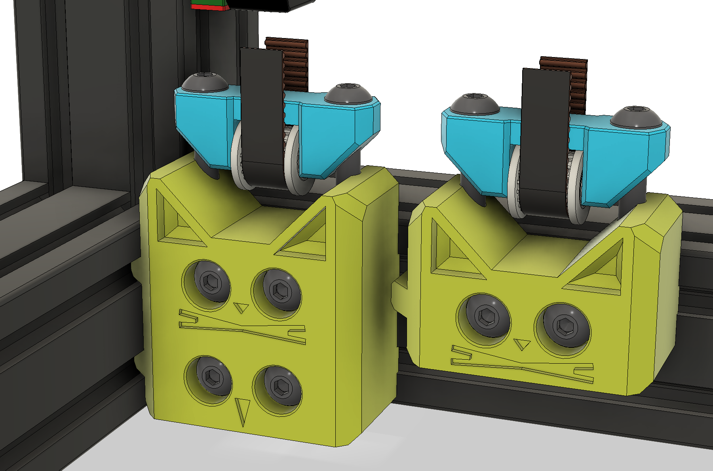
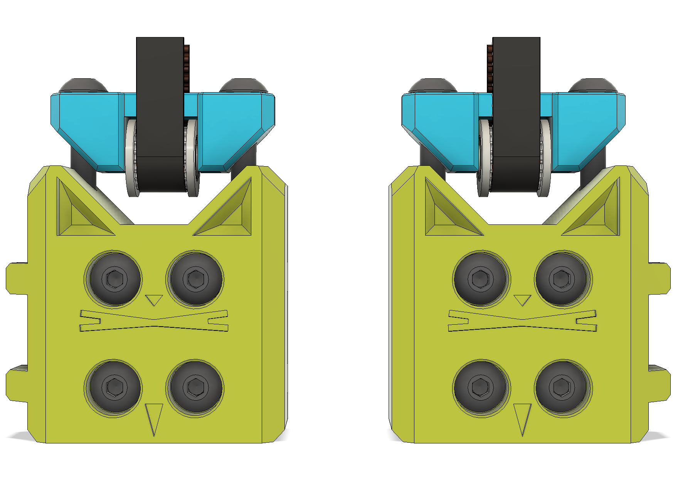
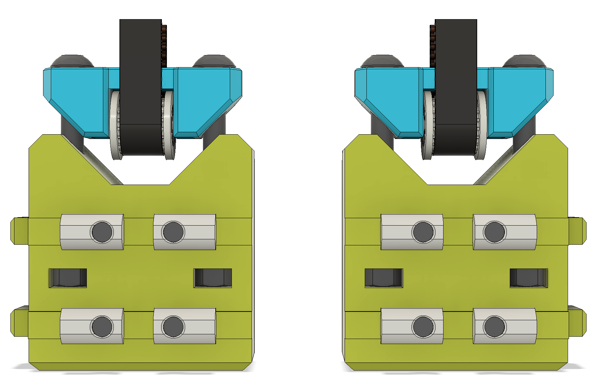

# BZI Frame for DoomCube 4040
I'm making a DoomCube 2.4 variant with 4040 extrusions for the frame.

These are extended idler bodies to take advantage of the deeper 4040 extrusions.

They have a Cat *and* a Bird on them.

Modifications:
* Hex nuts are now in the middle of the body.
* You'll need 2x M5 50mm BHCS instead of 40mm.
* You'll need 2x extra M5 Roll In nuts and 2x extra M5 25mm BHCS.

## Pictures

