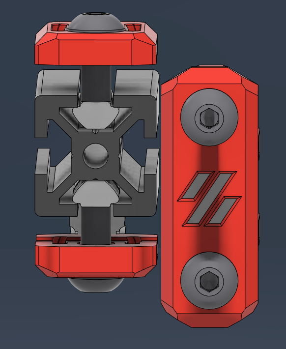
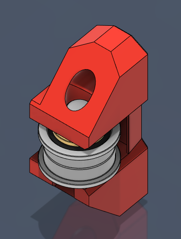
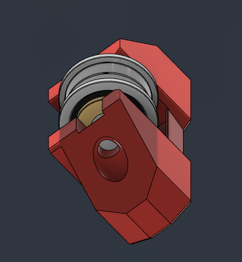

## V2.4 / Trident Fronts with Logos

Added dual color logo option for front plate.  If you just want a logo, print both the same color and slip them together. Meant to push together with no glue, but add a drop if you're paranoid or underextrude for fun.  Works on V2/VT

## V2.4 / Trident Grippy Carrier 

Updated carrier to allow the shaft to push from the top/bottom rather than slot in, as I was having issues keeping the shaft and bearings together during assembly.  Also provides a bit more give in shaft length for those like me that cut their own.  This will give up about 2mm in travel.  Hole in the bottom to a push the shaft back out when the time comes.  Works on V2/VT

